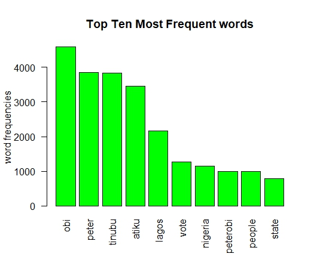
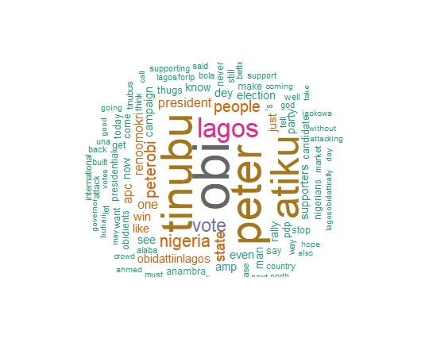
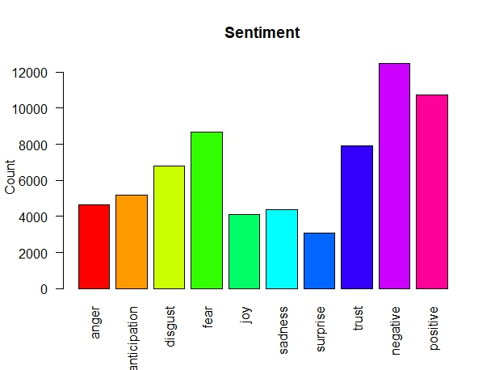

# Twitter Text Analysis of the 2023 Presidential Election in Nigeria.

This project is an RStudio project on Twitter Text Analysis of the three presidential candidates of the Major three political parties in Nigeria for the 2023 presidential election. This project was aimed at getting insights from Twitter users in Nigeria towards the 2023 presidential elections. Twitter was chosen as the choice social media tool to access vast opinions, this is a tool heavily used by Nigeria’s political elites and the largest percentage of the youth population in the country.

## Problem Statements
- What are the most frequent words?
- Who is the most talked about candidate?
- What is the most popular sentiments around the election?

## Analysis
- 9000 tweets about the presidential candidates of Labour Party(L.P.), Peoples Democratic Party(P.D.P), All Progressives Congress(A.P.C.) between february 11 to february 13 were collected and analyzed using Rstudio as the statistical tool.
- Sentiment analysis was ran to get insights into the opinions of Twitter users towards the elections.
- The R Script used for the entire process and analysis can be accessed [here.](https://github.com/DayoDak/Twitter-web-scrapping/blob/a35f547fa20d600d430466d11e7d89164cd3833a/Twitter%20scraping%20R%20Script)

## Visualisation
Three charts were created to provide answers to the problem statements.

- **The Most Frequent Words:** 
This problem statement was answered using two charts to give a better understanding. The **Bar Chart** shows the Top Ten most frequent words used during the period of consideration while the **Word Cloud** shows the 200 most used words during this same period.

| Bar Chart             | Word Cloud  |
:----------------------:|:--------------:
 | 

- **Sentiment Analysis:** This was ran to measure the opinions of Twitter users towards the 2023 Presidential election.

## Conclusions and Recommendations.
The result of the analysis shows Obi, Peter, Tinubu, Atiku and Lagos as the most used words during the period considered.
The sentiment analysis shows the public were more negative/toxic in their thoughts and opinions on Twitter towards the upcoming presidential election followed keenly by more positive and fearful opinions between the period considered.

**Recommendation:** **_Twitter users should refrain from using negative and fearful words as this promotes a toxic environment. Also, the government should try to allay the fears of the citizens towards the 2023 elections by ensuring a free and fair electoral process._**

